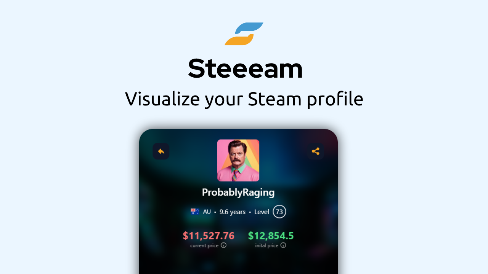
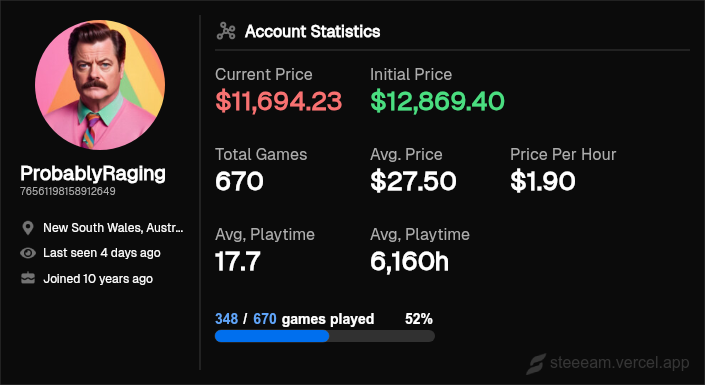
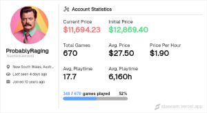
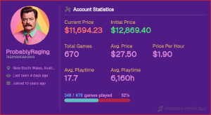

<p align="center">

 <h1 align="center">Steeeam - Visualize your Steam account</h1>
 <p align="center">Calculate your game library value, total playtime, average game cost, and more. Dynamically generate a shareable card to brag (or cry) about your collection on Discord, GitHub, and other platforms.</p>
</p>
  <p align="center">
    <a href="https://github.com/anuraghazra/github-readme-stats/graphs/contributors">
      
    </a>
    <a href="https://github.com/anuraghazra/github-readme-stats/issues">
      
    </a>
    <a href="https://github.com/anuraghazra/github-readme-stats/pulls">
      
    </a>
    <a href="https://securityscorecards.dev/viewer/?uri=github.com/anuraghazra/github-readme-stats">
      
    </a>
    <br />
    <br />
    <a href="https://vercel.com?utm\_source=github\_readme\_stats\_team\&utm\_campaign=oss">
      
    </a>
  </p>

# Shareable image
Dynamically generate your Steam card image directly in places like Discord channels, GitHub markdown files, and Facebook posts.

### Discord, Facebook, etc..
Use the base URL `https://steeeam.vercel.app/api/` and change `<steam_username_or_id>` to your Steam username or steamID64. Use [this tool](https://steamid.io/) to find your steamID64.
```
https://steeeam.vercel.app/api/<steam_username_or_id>
```

### GitHub, other markdown
Use it directly on GitHub or other places that accept markdown by copy/pasting this into your markdown.
```
[](https://steeeam.vercel.app)
```

# Customize your card
Personalize every aspect of your card to show off your personality by appending any of the options below, or use the pre-made `light` and `dark` themes for your convenience.

### Examples
```
https://steeeam.vercel.app/api/probablyraging
```


```
https://steeeam.vercel.app/api/probablyraging?theme=light
```


```
https://steeeam.vercel.app/api/probablyraging?bg_color=501b85&title_color=fff&text_color=db86d6&sub_title_color=e8b864&border_color=b32447&border_width=5&progbar_bg=b32447&progbar_color=5ebfc4
```


### Options
| Name              | Description                                            | Type               | Default value |
| ----------------- | ------------------------------------------------------ | ------------------ | ------------- |
| `bg_color`        | Card's background color.                               | string (hex color) | `0b0b0b`      |
| `title_color`     | Card's title color.                                    | string (hex color) | `ffffff`      |
| `sub_title_color` | Body sub-title color.                                  | string (hex color) | `adadad`      |
| `text_color`      | Body text color.                                       | string (hex color) | `ffffff`      |
| `cp_color`        | Current price text color.                              | string (hex color) | `f87171`      |
| `ip_color`        | Initial price text color.                              | string (hex color) | `4ade80`      |
| `div_color`       | Body divider color.                                    | string (hex color) | `ffffff`      |
| `border_color`    | Card's border color.                                   | string (hex color) | `ffffff30`    |
| `border_width`    | Card's border width. *(max 5)*                         | number             | `1`           |
| `hide_border`     | Hide the card's border                                 | boolean            | `false`       |
| `progbar_bg`      | Progress bar background color.                         | string (hex color) | `ffffff30`    |
| `progbar_color`   | Progress bar foreground color.                         | string (hex color) | `006fee`      |
| `theme`           | Choose from 'light' or 'dark'. (Overrides all options) | enum               | `dark`        |

..more themes, options, and card layouts coming soon. If you would like to contribute your own ideas, please feel free to create a PR.